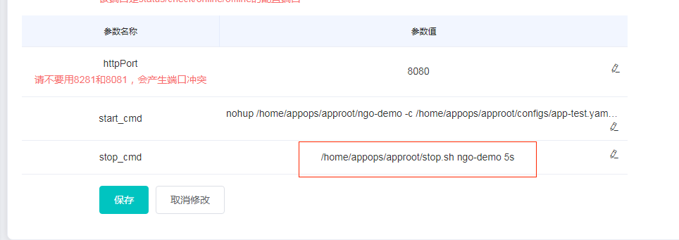

# [Ngo](https://github.com/NetEase-Media/ngo)

---
## 优雅关服
### 模块用途
提供应用的优雅关闭，主动释放资源、停止服务，防止强杀进程程序出现的异常状况
### 使用说明
ngo通过监听
`syscall.SIGQUIT`、
`syscall.SIGINT`、
`syscall.SIGTERM`任意一个信号进行关服，使用方无需在代码中调用server的`Stop`函数，yaml 中超时参数如下：
```yaml
httpServer:
  shutdownTimeout: 10s
```
#### 如何发送信号？
在诺亚配置中加入如下命令：

stop.sh为对应的发送信号脚本，
- 第一个参数为服务的关键字，用于查找进程id
- 第二个参数为脚本执行超时时间

stop.sh需要复制到镜像中，如果使用镜像不存在，联系pe填充。 

[stop.sh](../etc/script/stop.sh)

#### 如何关闭使用方自定义的服务？
服务在stop时，会关闭内置组件http server、pprof server、redis client、kafka client、httplib、 tracer、 xxljob。
使用方自定义组件可以在`s.PreStop(ctx)`函数中调用。