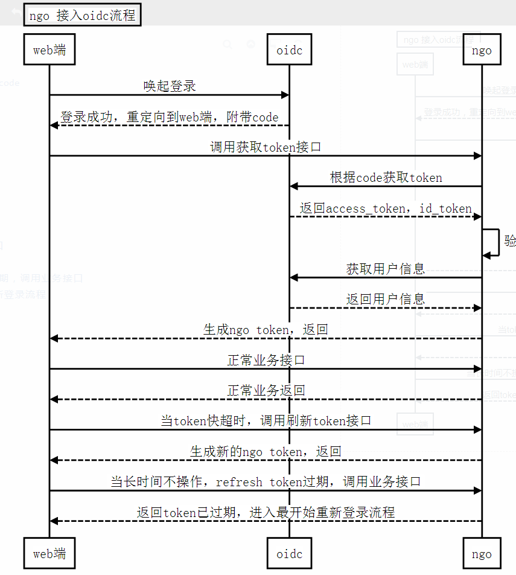

# [Ngo](https://github.com/NetEase-Media/ngo)

---
## 认证
### 模块用途
ngo框架集成了认证中间件, 当前支持为 jwt+openid 模式
### 使用说明
#### 流程



#### 集成方式

##### 修改配置文件

以下为默认值
```
httpServer:
  middlewares:
    jwtAuth:
      enabled: false -- 这里默认为false，需要改成true开启认证
      authHeader: Authorization --默认认证头
      tokenType: Bearer --默认value前缀
      accessTokenExpiresIn: 3600 --默认访问token有效时间，单位s
      refreshTokenExpiresIn: 7200 --默认刷新token有效时间，单位s
      encryption: HS256 --默认加密方式
      oidc:  -- https://login.netease.com/sitemgnt/create/ 建立新站点，会生成id和secret
        clientId: xxxxxxxxx
        clientSecret: xxxxxxxxx
        encryption: HS256
      routePathPrefix: "" --内置接口前缀,默认为空 
      ignorePaths:
        - /xxx --忽略路径，这里为前缀匹配
```

##### 系统内置接口

获取token, detail=true 会调oidc获取用户信息
```
GET /auth/access-token?code=&redirectUri=&detail=true|false
```
刷新token
```
GET /auth/refresh-token?refreshToken=

Header
Authorization: Bearer {accessToken}
```
响应token json格式为
```
{
    "accessToken": "xxxx",
    "expiresIn": 7200,
    "refreshToken": "xxxx"
}
```

如果不想使用内置接口，可以自己添加路由，系统提供函数如下
```
// CreateTokenHandler 创建token
func (a *JwtAuth) CreateTokenHandler(c *gin.Context)
// RefreshTokenHandler 刷新token
func (a *JwtAuth) RefreshTokenHandler(c *gin.Context)
// GetTokenString 获取token字符串
func (a *JwtAuth) GetTokenString(c *gin.Context) (string, error)
// GenToken 生成token
// param identity 用户名
// param tokenExt 生成的token附加信息
// param ext 响应token报文附加信息
func (a *JwtAuth) GenToken(identity string, tokenExt interface{}, ext interface{}) (*TokenInfo, error)
// GetToken 获取token
func (a *JwtAuth) GetToken(tokenString string, ignoreVerify bool) (*jwt.Token, error)
```

方法err说明

- GenTokenErr 生成token error
- GetTokenErr 获取token error
- ParamsLostErr 参数丢失 error
- ParamsNotAvailableErr 无效参数 error

##### 扩展方法，如果不加走系统默认

```
// AddAdminAuthHandler 扩展处理方法
// param auth openid通过后的回调，用来验证业务后台用户逻辑，返回的第二个参数需要存入token的信息，返回的信息尽量少，否则token很长
// param gtRsp 获取token和刷新token后回调的方法，用来自定义响应报文格式
// param unauthRsp  token验证失败的回调方法，用来自定义响应报文格式
func (s *Server) AddAdminAuthHandler(auth Authenticator, gtRsp GenTokenResponse, unauthRsp UnauthenticatedResponse) *Server
```
