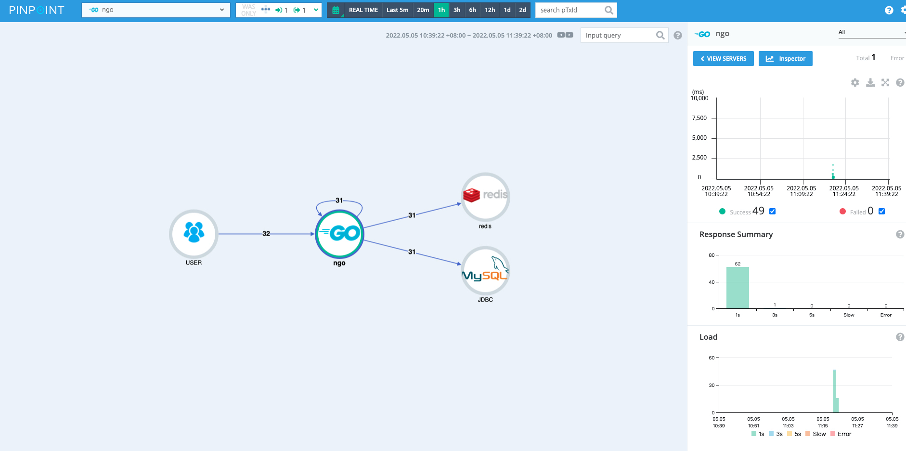

[Ngo](https://github.com/NetEase-Media/ngo)

---
# tracing
链路采集和跟踪是分布式系统排障的重要组成部分。市场上大部分产品都支持opentracing规范，例如jaeger、zipkin、skywalking以及传媒自研的optimus，
同时也存在非opentracing规范的产品，例如严选用的pinpoint。ngo的tracing模块整合了这两类产品，提供了一个统一的接口，支持多种tracing方案，用户可以无需更改代码快速切换。同时提供ngo内部组件的采集支持，包含：
- httpserver
- db
- redis
- httpclient

具体接入，我们只需要在配置文件中配置tracing参数即可，例如pinpoint配置：
```yaml
tracing:
  enabled: true
  type: pinpoint
  pinpoint:
    applicationName: ngo
    collector:
      host: xx.xx.xx.xx
      agentPort: 31440
      spanPort: 31226
      statPort: 31950
    sampling:
      rate: 1  # 100%
```

效果如图：
